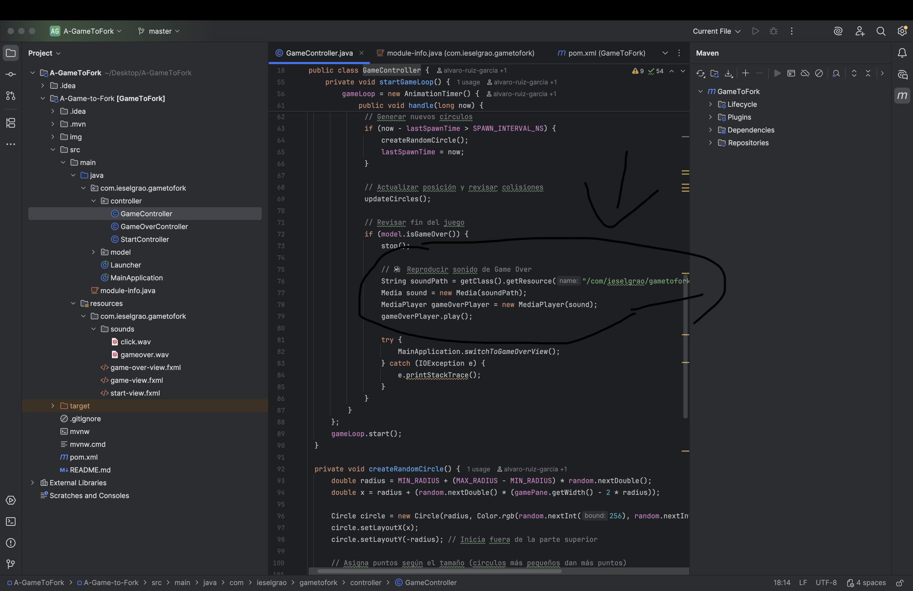
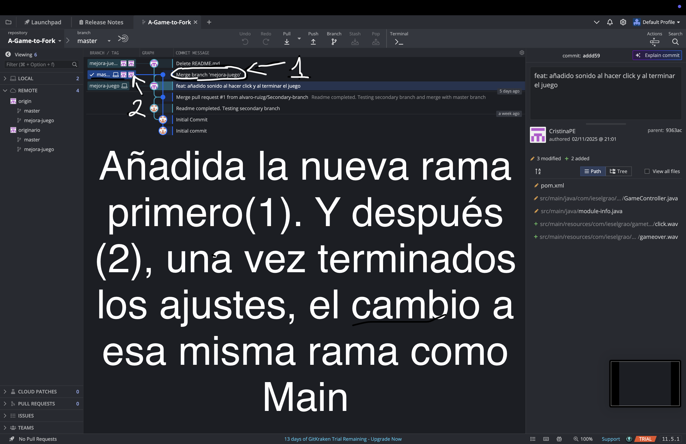
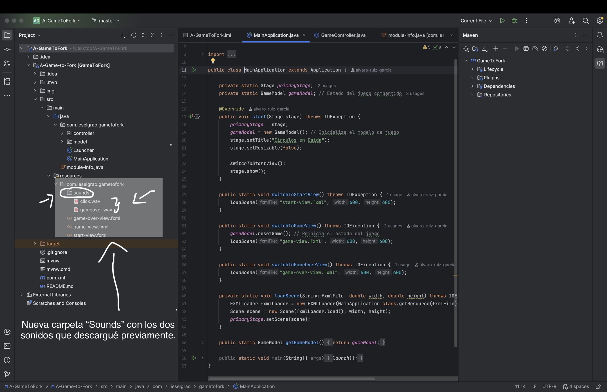
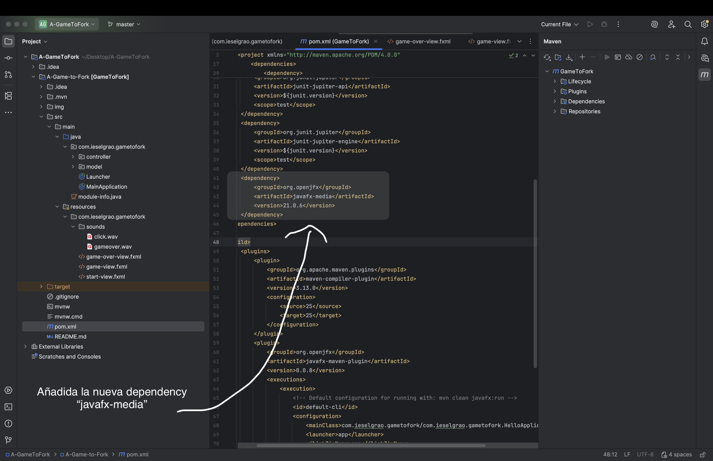
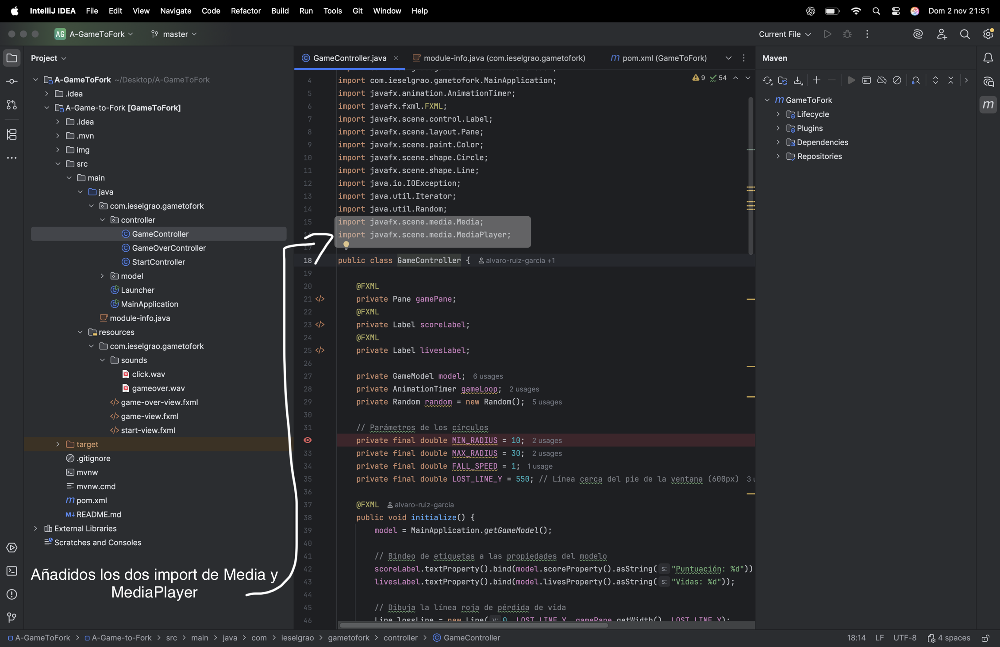
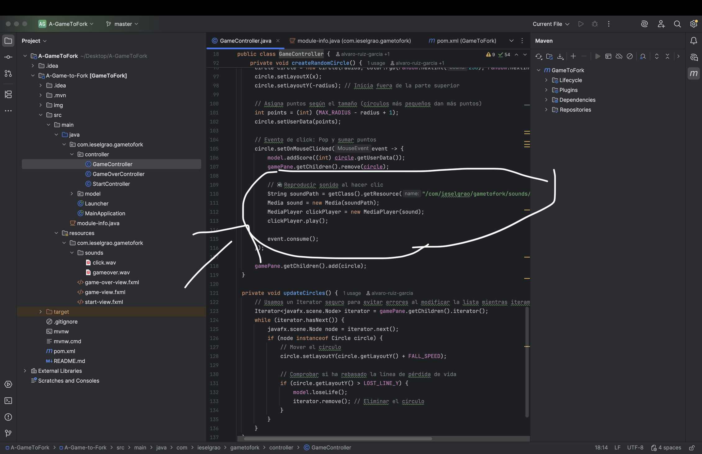

# A Game to be Improved 

##  Mejoras realizadas
- Se añadió sonido al hacer clic en los círculos (`click.wav`).
- Se añadió música al finalizar el juego (`gameover.wav`).
- Se creó una carpeta `resources/sounds` con los archivos de audio.
- Se actualizó `GameController.java` para reproducir los sonidos.
- Se añadió la dependencia `javafx-media` al `pom.xml`.

## Proceso de fork y desarrollo
1. Se hizo un **fork** del repositorio original del profesor.
2. Se clonó el proyecto con **GitKraken**.
3. Se creó una nueva **rama de desarrollo** (`mejora-juego`).
4. Se realizaron los cambios y **commits** correspondientes.
5. Se hizo **push** de la rama al repositorio remoto.
6. Finalmente, se **fusionó la rama de mejora con `main`**.
7. Se probó el juego en IntelliJ, verificando el correcto funcionamiento del sonido.

##  Capturas del proceso

## 💻 Ejecución del proyecto
Este proyecto usa JavaFX + Maven.  
Ejecutar desde IntelliJ:  
**Main class:** `com.ieselgrao.gametofork.MainApplication`
